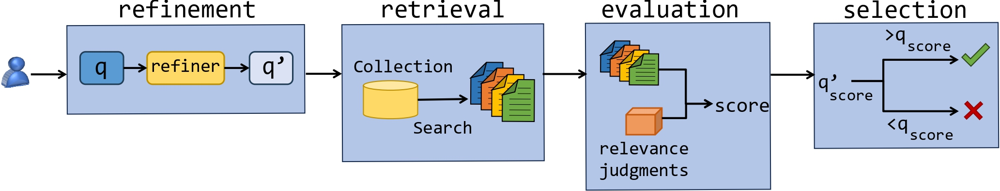

# RePair

The RePair project is an open-source initiative designed to generate datasets containing pairs of original and refined queries. This pipeline involves multiple steps: it first takes an initial query, refines it to better capture the user's intent, retrieves relevant documents based on the refined query, evaluates the results, and then generates the pairs of original and refined queries. This comprehensive process helps in creating high-quality datasets that can be used to train and evaluate query refinement models more effectively.

## Table of Contents
<table align="center" border=0>
<tr>
<td>
   
1. [Introduction](#Introduction)
2. [Refinement](#Refinement)
3. [Retrieval](#Retrieval)
4. [Evaluation](#Evaluation)
5. [Selection](#Selection)
6. [Branches](#Branches)
7. [Acknowledgement](#Acknowledgement)
</td>
<td></td>
</table>

   
## 1. Introduction
Web users often struggle to express their information needs clearly in short, vague queries, making it challenging for search engines to retrieve relevant results. The precision of search queries is essential, as it directly affects the quality and relevance of the search outcomes. Query refinement, which aims to improve search relevance by adjusting original queries, plays a crucial role in addressing this challenge. Effective query refinement can bridge the gap between user intent and search engine interpretation, leading to more accurate and satisfactory search results. However, current evaluation methods for query refinement models may not accurately reflect real-world usage patterns, highlighting the need for more robust evaluation frameworks.

In this GitHub repository, we present different versions of the RePair project, accessible through various branches. The main branch contains the most updated version, ensuring users have access to the latest improvements and features of the RePair project.

All the following steps can be configured in the [`param.py`](https://github.com/fani-lab/RePair/blob/cb94e0e4b8e85481e737f7e37b2268bfd0c49db3/src/param.py#L12) file.

## 2. Refinement
In the refinement step, both supervised and unsupervised methods can be employed to generate the refined version of the original query. Supervised methods leverage pre-existing labeled datasets to train models that can accurately interpret and enhance the initial queries based on learned patterns and examples. On the other hand, unsupervised methods do not rely on labeled data; instead, they utilize various techniques such as clustering, backtranslation, or relevance feedback to refine queries. By combining these approaches, the RePair project ensures that the refined queries are not only contextually appropriate but also diverse, capturing a broader range of potential user intents. This dual approach significantly enhances the quality and relevance of the retrieved documents, ultimately leading to more effective and accurate search results.

The refiners can be selected in the [`refiner.py`](https://github.com/fani-lab/RePair/blob/cb94e0e4b8e85481e737f7e37b2268bfd0c49db3/src/refinement/refiner_param.py) file.

## 3. Retrieval
In the retrieval step, either dense retrievers such as colbert or sparse retrievers such as bm25 and qld are used to retrieve relevant documents related to the refined versions of the query. Dense retrievers like colbert employ neural networks to encode queries and documents into dense vectors, capturing semantic similarities at a deeper level. This allows for more detailed matching between the refined query and potential results. On the other hand, sparse retrievers like bm25 and qld rely on traditional term-based scoring methods, efficiently identifying documents that contain significant terms from the refined query. By utilizing both dense and sparse retrieval methods, the RePair project ensures a comprehensive and balanced retrieval process, capturing both semantic depth and term frequency, which ultimately leads to more relevant and accurate search outcomes.

Retrievers can be set in [`param.py`](https://github.com/fani-lab/RePair/blob/cb94e0e4b8e85481e737f7e37b2268bfd0c49db3/src/param.py#L18) file.

## 4. Evaluation
In the evaluation step, the retrieved list of documents is assessed based on relevance judgments to assign a score. This involves comparing the retrieved documents against a set of predefined relevance criteria to determine how well each document matches the user's information needs as expressed in the refined query. By systematically scoring the relevance of each document, this step provides a quantitative measure of the effectiveness of the query refinement process. At the end of this step, each refined version of the original query is evaluated, allowing for a detailed analysis of the refinement's impact on retrieval performance. 

Metrics can be set in [`param.py`](https://github.com/fani-lab/RePair/blob/cb94e0e4b8e85481e737f7e37b2268bfd0c49db3/src/param.py#L19) file.

## 5. Selection
At last comes the selection step. In this step, the score assigned to each refined query is compared to the score of the original query. If the score of a refined query is higher, it is selected as the refined version of the original query. This comparison ensures that only those refinements that demonstrably improve search relevance are chosen. By the end of this step, a gold standard dataset is generated, consisting of pairs of original queries and their corresponding refined versions. This dataset serves as a valuable resource for training and evaluating supervised query refinement models, providing a benchmark for further research and development in enhancing search engine performance.

## 6. Branches
- [main](https://github.com/fani-lab/RePair/tree/main): This branch hosts the most recent version of the RePair project.
- [cikm23](https://github.com/fani-lab/RePair/tree/cikm23): This branch includes RePair 1.0, which focuses solely on query refinement using the T5 large language model.
- [nqlb](https://github.com/fani-lab/RePair/tree/nqlb): This branch features RePair 2.0, incorporating both the T5 large language model and global and local refiners.
- [rrf](https://github.com/fani-lab/RePair/tree/rrf): This branch contains RePair 2.1, which includes RAG and RAG fusion, along with various fusion metrics.

## 7. Acknowledgement
We benefit from [`trec_eval`](https://github.com/usnistgov/trec_eval), [`pyserini`](https://github.com/castorini/pyserini), [`ir-dataset`](https://ir-datasets.com/), and other libraries. We would like to thank the authors of these libraries and helpful resources.
  

