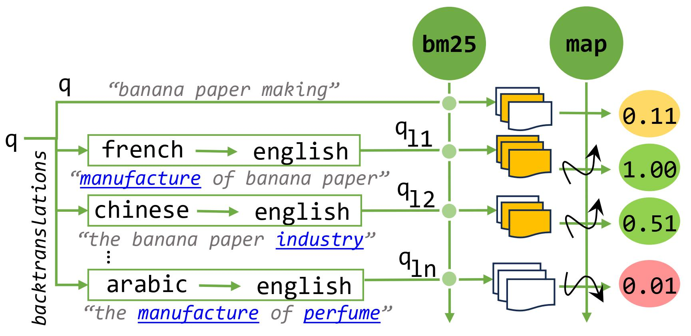
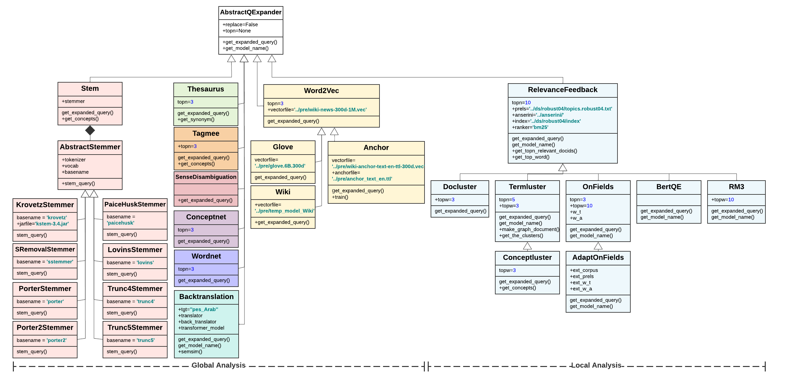

# Enhancing RAG’s Retrieval via Query Backtranslations
Retrieval-augmented generation (rag) systems extend the capabilities of generating responses beyond the pretrained knowledge of large language models by augmenting the input prompt with relevant documents retrieved by an information retrieval system, which is of particular importance when knowledge is constantly updated and cannot be memorized by the model. Rag-based systems operate in two phases: retrieval and generation. In the retrieval phase, documents are retrieved from various versions of the original query, then fused and reranked to create a unified list, and the more relevant list of documents, the better the subsequent generation phase. 

Here, we propose using backtranslation as an unsupervised method to enhance the retrieval phase by transforming an original query into newly reformulated versions without semantic drift to enhance the relevance of the retrieved documents. We believe that backtranslation can:

   1. Identify missing terms in a query that are assumed to be understood due to their common usage in the original language.
   2. Include relevant synonyms from the target language to provide additional context.
   3. Clarify the meaning of ambiguous terms or phrases.

Specifically, for an original query, 
   
   1. we generate its backtranslated versions via different languages, 
   2. retrieve an ordered list of relevant documents for each backtranslated version
   3. finally, merge the lists of retrieved documents into a single ranked list via reciprocal rank fusion.
  
<table align="center" border=0>
<thead>
  <tr><td colspan="3" style="background-color: white;"></td></tr>     
  <tr><td colspan="3">
      <p align="center">Generating backtranslated versions of an original query and fusing retrieved document sets for rag-based query refinement.</p>
 </thead>
</table>
   
- [1. Setup](#1-setup) [[`lucene indexes`](#lucene-indexes)]
- [2. Quickstart](#2-quickstart) [[`query_refinement`](#query_refinement), [`similarity`](#similarity), [`rag`](#rag), [`search`](#search), [`rag_fusion`](#rag_fusion), [`eval`](#eval), [`agg, box`](#agg-box)]
- [3. File Structure](#3-file-structure)
- [4. Acknowledgement](#4-acknowledgement)

## 1. Setup
You need to have ``Python=3.8`` and install [`pyserini`](https://github.com/castorini/pyserini/) package (needs `Java`), among others listed in [``requirements.txt``](requirements.txt). 
You may also need to install [anserini](https://github.com/castorini/anserini). Only for indexing purposes and RelevanceFeedback refiner.
> [!IMPORTANT]   
> Anserini is only compatible with Java version 11. Using versions older or newer than this will result in an error.
>
We also suggest you clone our repo with the `--recurse-submodules` (alternatively, use the `git submodule update --init` inside the cloned repository) to get the [`trec_eval`](https://github.com/usnistgov/trec_eval) metric evaluation tool:

By ``pip``, clone the codebase and install the required packages:
```sh
pip install -r requirements.txt
```

By [``conda``](https://www.anaconda.com/products/individual):

```sh
conda env create -f environment.yml
conda activate repair
```
_Note: When installing `Java`, remember to set `JAVA_HOME` in Windows's environment variables._

For [`trec_eval`](https://github.com/usnistgov/trec_eval):
```sh
cd src/trec_eval.9.0.4
make 
cd ..
```

### lucene indexes
To perform fast IR tasks, we need to build the sparse indexes of document corpora or use the [`prebuilt-indexes`](https://github.com/castorini/pyserini/blob/master/docs/prebuilt-indexes.md). The path to the index need to be set in [`./src/param.py`](./src/param.py).

## 2. Quickstart
For using query refinement make sure to add the command to the pipeline in the [./src/param.py](./src/param.py).

As seen in the above [`workflow`](./misc/workflow.png), `RePair` has three pipelined steps: 
> 1. Refining Quereis: [`query_refinement`]
> 2. Performance Evaluation: [`search`, `eval`]
> 3. Dataset Curation: [`agg`, `box`]

To run `RePair` pipeline, we need to set the required parameters of each step in [`./src/param.py`](./src/param.py) such as the ranker used in the search step. Then, the pipeline can be run by its driver at [`./src/main.py`](./src/main.py):

```sh
python -u main.py -data ../data/raw/robust04 -domain robust04
```

### [`['query_refinement']`](./src/refinement/refiner_param.py#L9)

# Refiners
The objective of query refinement is to produce a set of potential candidate queries that can function as enhanced and improved versions. This involves systematically applying various unsupervised query refinement techniques to each query within the input dataset.

<table align="center" border=0>
<thead>
  <tr><td colspan="3" style="background-color: white;"></td></tr>     
  <tr><td colspan="3">
      <p align="center">Class Diagram for Query Refiners in <a href="./src/refinement/">src/refinement/</a>. [<a href="https://app.lucidchart.com/documents/view/64fedbb0-b385-4696-9adc-b89bc06e84ba/HWEp-vi-RSFO">zoom in!</a>].</p>
      <p align="center"> The expanders are initialized by the Expander Factory in <a href="./src/refinement/refiner_factory.py">src/refinement/refiner_factory.py</a></p></td></tr> 
 </thead>
</table>

Here is the list of queries:
| **Expander** 	| **Category** 	| **Analyze type** 	|
|---	|:---:	|:---:	|
| adaponfields 	| Top_Documents 	| Local 	|
| anchor 	| Anchor_Text 	| Global 	|
| [backtranslation](#Backtranslation) 	| Machine_Translation 	| Global 	|
| bertqe] 	| Top_Documents 	| Local 	|
| conceptluster 	| Concept_Clustering 	| Local 	|
| conceptnet 	| Semantic_Analysis 	| Global 	|
| docluster 	| Document_Summaries 	| Local 	|
| glove 	| Semantic_Analysis 	| Global 	|
| onfields 	| Top_Documents 	| Local 	|
| relevancefeedback 	| Top_Documents 	| Local 	|
| rm3 	| Top_Documents 	| Local 	|
| sensedisambiguation 	| Semantic_Analysis 	| Global 	|
| stem.krovetz 	| Stemming_Analysis 	| Global 	|
| stem.lovins 	| Stemming_Analysis 	| Global 	|
| stem.paicehusk 	| Stemming_Analysis 	| Global 	|
| stem.porter 	| Stemming_Analysis 	| Global 	|
| stem.sstemmer 	| Stemming_Analysis 	| Global 	|
| stem.trunc 	| Stemming_Analysis 	| Global 	|
| tagmee 	| Wikipedia 	| Global 	|
| termluster 	| Term_Clustering 	| Local 	|
| thesaurus 	| Semantic_Analysis 	| Global 	|
| wiki 	| Wikipedia 	| Global 	|
| word2vec 	| Semantic_Analysis 	| Global 	|
| wordnet 	| Semantic_Analysis 	| Global 	|

# Backtranslation
Back translation, also known as reverse translation or dual translation, involves translating content, whether it is a query or paragraph, from one language to another and retranslating it to the original language. This method provides several options for the owner to make a decision that makes the most sense based on the task at hand.
For additional details, please refer to this [document](./misc/Backtranslation.pdf).

## Example
| **q** 	| **map q** 	| **language** 	| **translated q** 	| **backtranslated q** 	| **map q'** 	|
|---	|:---:	|:---:	|:---:	|:---:	|:---:	|
| Italian nobel prize winners 	| 0.2282 	| farsi 	| برندهای جایزه نوبل ایتالیایی 	| Italian Nobel laureates 	| 0.5665 	|
| banana paper making 	| 0.1111 	| korean 	| 바나나 종이 제조 	| Manufacture of banana paper 	| 1 	|
| figs 	| 0.0419 	| tamil 	|  அத்திமரங்கள்  	| The fig trees 	| 0.0709 	|


### [`['similarity']`](./src/param.py#L12)

To evaluate the quality of the refined queries, metrics such as bleu, rouge, and semsim are employed. The bleu score measures the similarity between the backtranslated and original query by analyzing n-grams, while the rouge score considers the overlap of n-grams to capture essential content. Due to their simplicity and effectiveness, these metrics are widely utilized in machine translation tasks. Despite their usefulness, both scores may not accurately capture the overall meaning or fluency of the translated text due to their heavy reliance on n-grams. To address topic drift and evaluate the similarity between the original and refined queries, we additionally employ [declutr](https://aclanthology.org/2021.acl-long.72/) for query embeddings, computing cosine similarity. Declutr, a self-learning technique requiring no labeled data, minimizes the performance gap between unsupervised and supervised pretraining for universal sentence encoders during the extension of transformer-based language model training. The semsim metric, relying on cosine similarity of embeddings, proves highly effective in capturing the subtle semantic nuances of language, establishing itself as a dependable measure of the quality of backtranslated queries.

The below images demonstrate the average token count for the original queries in English and their backtranslated versions across various languages, along with the average pairwise semantic similarities measured using 'rouge' and 'declutr'. It's evident that all languages were able to introduce new terms into the backtranslated queries while maintaining semantic coherence.


## Example
These samples are taken from an ANTIQUE dataset that has been refined using a backtranslation refiner with the German language.
| **id** 	| **original** 	| **refined** 	| **rouge1** 	| **rouge2** 	| **rougeL** 	| **rougeLsum** 	| **bleu** 	| **precisions** 	| **brevity_penalty** 	| **length_ratio** 	| **translation_length** 	| **reference_length** 	| **semsim** 	|
|---	|:---:	|:---:	|:---:	|:---:	|:---:	|:---:	|:---:	|:---:	|:---:	|:---:	|:---:	|:---:	|:---:	|
| 1290612 	| why do anxiety and depression seem to coexist? 	| Why do fear and depression seem to be linked 	| 0.705882 	| 0.533333 	| 0.705882 	| 0.705882353 	| 0.315598 	| [0.5555555555555556, 0.375, 0.2857142857142857,   0.16666666666666666] 	| 1 	| 1 	| 9 	| 9 	| 0.8554905 	|
| 4473331 	| How can I keep my   rabit indoors? 	| How can I keep my   rabbit in the house 	| 0.625 	| 0.571429 	| 0.625 	| 0.625 	| 0.446324 	| [0.5555555555555556,   0.5, 0.42857142857142855, 0.3333333333333333] 	| 1 	| 1.125 	| 9 	| 8 	| 0.7701595 	|
| 1509982 	| How is the Chemistry is a basic of Science? 	| How is chemistry a principle of science 	| 0.75 	| 0.285714 	| 0.75 	| 0.75 	| 0 	| [0.5714285714285714, 0.16666666666666666, 0.0, 0.0] 	| 0.651439058 	| 0.7 	| 7 	| 10 	| 0.7796929 	|

### [`['rag']`](./src/param.py#L12)
Retrieval-augmented models aim to enhance response accuracy and reliability through two phases: retrieval and generation. When activated, these models use an external source like Wikipedia to search the original query and find relevant documents and content. If no relevant information is found, 'None' is returned. The original query, along with any retrieved documents, is then passed to a llm such as 't5', which generates a response. 

### [`['search']`](./src/param.py#L17)
We search the relevant documents for both the original query and each of the `potential` refined queries. We need to set an information retrieval method, called ranker, that retrieves relevant documents and ranks them based on relevance scores. We integrate [`pyserini`](https://github.com/castorini/pyserini), which provides efficient implementations of sparse and dense rankers, including `bm25` and `qld` (query likelihood with Dirichlet smoothing). 

### [`['rag_fusion']`](./src/refinement/refiner_param.py#L9)
If this command is activated, it will fuse the results based on the selected ['categories'](./src/param.py#L15) and ['fusion method'](./src/param.py#L16) specified in the parameters.
Categories are as follows:
 - all: Considers all documents retrieved for all query variations. 
 - global: Considers only the documents retrieved for queries generated by global refiners.
 - local: Considers only the documents retrieved for queries generated by local refiners.
 - bt: Considers only the documents retrieved for queries generated by translators models.
 - bt_nllb: Considers only the documents retrieved for queries generated by the nllb translator model.

Fusion methods are:
 - rrf: Calculate reciprocal rank fusion for a k. 
 - rrf_multi_k: Calculate reciprocal rank fusion for a list of ks.
 - condorcet: Calculate Condorcet Fuse.
 - random: Randomly assign scores to the documents and then fuse them.

### [`['eval']`](./src/param.py#L20)
The search results of each potential refined queries are evaluated based on how they improve the performance with respect to an evaluation metric like `map`, `mrr`, or `ndcg`. 


### [`['agg']`](./src/param.py#L12)
Finaly, we keep those potential refined queries whose performance (metric score) have been better or equal compared to the original query.

We keep two these datasets as the outcome of the `RePair` pipeline:

> 1. `./output/{input query set}/{ranker}.{metric}.agg/{ranker}.{metric}.agg.{selected refiner}.all.tsv`
> 2. `./output/{input query set}/{ranker}.{metric}.agg/{ranker}.{metric}.agg.{selected refiner}.gold.tsv`
> 3. `./output/{input query set}/{ranker}.{metric}.agg/{ranker}.{metric}.agg.{selected refiner}.platinum.tsv`
> 4. `./output/{input query set}/{ranker}.{metric}.agg/{ranker}.{metric}.agg.{selected refiner}.negative.tsv`

```
'agg': {'all':               'all predicted refined queries along with the performance metric values',
        'gold':              'refined_q_metric >= original_q_metric and refined_q_metric > 0',
        'platinum':          'refined_q_metric > original_q_metric',
        'negative':          'refined_q_metric < original_q_metric}
```
The 'selected refiner' option refers to the categories we experiment on and the create a datasets:
 - nllb: Only backtranslation with nllb
 - -bt: Other refiners than backtranslartion
 - +bt: All the refiners except bing translator
 - allref: All the refiners

## 3. File Structure

The final structure of the output will look like the below:

```bash
├── output
│   └── dataset_name                                 [such as robust04]
│       └── refined_queries_files                    [such as refiner.bt_bing_persian]
│       └── rag
│       │   └── rag_predictions                      [such as pred.base.local.0]
│       │   └── rag_ranker_files                     [such as pred.base.local.0.bm25]
│       │   └── rag_metric_files                     [such as pred.base.local.0.bm25.map]
│       └── ranker.metric                            [such as bm25.map]
│           └── ranker_files                         [such as refiner.bt_bing_persian.bm25]
│           └── metric_files                         [such as refiner.bt_bing_persian.bm25.map]
│           └── rag               
│           │    └── fusion                          [such as bm25.map.agg.+bt.all.tsv]
│           │        └── multi    
│           │        │   └── multi_k_ranker_files    [such as rag.bt.k0.bm25]
│           │        │   └── multi_k_metric_files    [such as rag.bt.k0.bm25.map]
│           │        └── rag_fusion_files            [bm25.map.agg.all.tsv]
│           └── agg                                  [such as refiner.bt_bing_persian.bm25]
│                └── agg_files                       [such as bm25.map.agg.+bt.all.tsv]
─
```

The results are available in the [./output](./output) file.

## 4. Acknowledgment
We benefit from [``trec_eval``](https://github.com/usnistgov/trec_eval), [``pyserini``](https://github.com/castorini/pyserini), [``ir-dataset``](https://ir-datasets.com/), and other libraries. We would like to thank the authors of these libraries and helpful resources.
  
