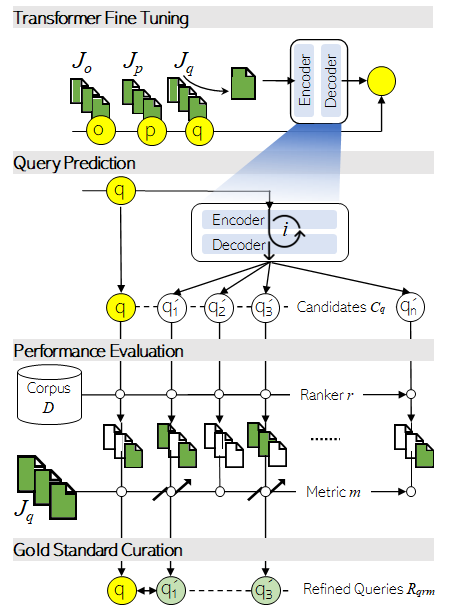

# ``RePair``: A Toolkit for Query Refinement Gold Standard Generation
Search engines have difficulty searching into knowledge repositories since they are not tailored to the users' information needs. User's queries are, more often than not, under-specified that also retrieve irrelevant documents. Query refinement, also known as query `reformulation`, or `suggesetion`, is the process of transforming users' queries into new `refined` versions without semantic drift to enhance the relevance of search results. Prior query refiners have been benchmarked on web retrieval datasets following `weak assumptions` that users' input queries improve gradually within a search session. To fill the gap, we contribute `RePair`, an open-source configurable toolkit to generate large-scale gold-standard benchmark datasets from a variety of domains for the task of query refinement. `RePair` takes a dataset of queries and their relevance judgements (e.g. `msmarco` or `aol`), an information retrieval method (e.g., `bm25`), and an evaluation metric (e.g., `map`), and outputs refined versions of queries using a transformer (e.g., [`T5`](https://github.com/google-research/text-to-text-transfer-transformer)), each of which with the relevance improvement guarantees. Currently, `RePair` includes gold standard datasets for [`aol-ia`](https://dl.acm.org/doi/abs/10.1007/978-3-030-99736-6_42) and [`msmarco.passage`](https://www.microsoft.com/en-us/research/publication/ms-marco-human-generated-machine-reading-comprehension-dataset/).

**Future Work**: We are investigating `contexual` query refinement by incorporating query session information like user or time information of queries on the performance of neural query refinement methods compared to the lack thereof.

1. [Setup](#1-setup)
2. [Quickstart](#2-quickstart)
3. [Gold Standard Datasets](#3-gold-standard-datasets)
4. [Acknowledgement](#4-acknowledgement)
5. [License](#5-license)

<p align="center"></p>

## 1. Setup
You need to have ``Python=3.8`` and install [`pyserini`](https://github.com/castorini/pyserini/) package (needs `Java`), among others listed in [``requirements.txt``](requirements.txt). We also suggest you to clone our repo with the `--recurse-submodules` (altenatively, use the `git submodule update --init` inside the cloned repository) to get the [`trec_eval`](https://github.com/usnistgov/trec_eval) metric evaluation tool:

By ``pip``, clone the codebase and install the required packages:
```sh
git clone https://github.com/Fani-Lab/RePair --recurse-submodules
cd RePair
pip install -r requirements.txt
```

By [``conda``](https://www.anaconda.com/products/individual):

```sh
git clone https://github.com/Fani-Lab/RePair --recurse-submodules
cd RePair
conda env create -f environment.yml
conda activate repair
```
_Note: When installing `Java`, remember to set `JAVA_HOME` in Windows's environment variables._

For [`trec_eval`](https://github.com/usnistgov/trec_eval):
```sh
cd src/trec_eval.9.0.4
make 
```

### Lucene Indexes
To perform fast IR tasks, we need to build the indexes of document corpora or use the [`prebuilt-indexes`](https://github.com/castorini/pyserini/blob/master/docs/prebuilt-indexes.md) like [`msmarco.passage`](https://rgw.cs.uwaterloo.ca/JIMMYLIN-bucket0/pyserini-indexes/lucene-index.msmarco-v1-passage.20220131.9ea315.tar.gz). The path to the index need to be set in [`./src/param.py`](./src/param.py) like [`param.settings['msmarco.passage']['index']`](./src/param.py#L24).

In case there is no prebuilt index, steps include collecting the corpus and building an index as we did for [`aol-ia`](https://dl.acm.org/doi/abs/10.1007/978-3-030-99736-6_42) using [`ir-datasets`](https://ir-datasets.com/aol-ia.html).

## 2. Quickstart
We use [`T5`](https://github.com/google-research/text-to-text-transfer-transformer) to train a model, that when given an input query (origianl query), generates refined (better) versions of the query in terms of retrieving more relevant documents at higher ranking positions. Currently, we finetuned [`T5`](https://github.com/google-research/text-to-text-transfer-transformer) model on `msmarco.passage` (no context) and `aol` (w/o `userid`). For `yandex` dataset, we will train [`T5`](https://github.com/google-research/text-to-text-transfer-transformer) from scratch since the tokens are anonymized by random numbers. 

As seen in the above [`workflow`](./misc/workflow.png), `RePair` has four pipelined steps: 
> 1. Transformer Finetuning: [`pair`, `finetune`]
> 2. Refined Query Prediction: [`predict`]
> 3. Performance Evaluation: [`search`, `eval`]
> 4. Dataset Curation: [`agg`, `box`]

To run `RePair` pipeline, we need to set the required parameters of each step in [`./src/param.py`](./src/param.py) such as pairing strategy ([`pairing`](./src/param.py#L28)) for a query set, the choice of transformer ([`t5model`](./src/param.py#L14)), and etc. Then, the pipeline can be run by its driver at [`./src/main.py`](./src/main.py):

```sh
python -u main.py -data ../data/raw/toy.msmarco.passage -domain msmarco.passage
```
```sh
python -u main.py -data ../data/raw/toy.aol-ia -domain aol-ia
```
```sh
python -u main.py -data ../data/raw/toy.msmarco.passage ../data/raw/toy.aol-ia -domain msmarco.passage aol-ia
```

### [`['pair']`](./src/param.py#L25)
We create training sets based on different pairings of queries and relevant passages in the [`./data/preprocessed/{domain name}/`](./data/preprocessed/) for each domain like [`./data/preprocessed/toy.msmarco.passage/`](./data/preprocessed/toy.msmarco.passage/) for `msmarco.passage`.

1. `ctx.query.docs`: context: query -> _concatenated_ relevant documents (passages) 
2. `ctx.docs.query`: context: _concatenated_ relevant documents (passages) -> query, like in [docTTTTTTQuery](https://github.com/castorini/docTTTTTquery#learning-a-new-prediction-model-t5-training-with-tensorflow)
3. `ctx.query.doc`: context: query -> relevant document (passage)
4. `ctx.doc.query`: context: relevant documents (passages) -> query

where the context will be `userid` (personalized) or empty (context free). For instance, for `msmarco.passage` which has no contextual information, we have [`docs.query`](./data/preprocessed/toy.msmarco.passage/docs.query.passage.train.tsv) or `query.docs` since there is no context. Further, if a query has more than one relevant documents, we can either _concatenate_ all relevant documents into a single document, i.e., `doc`+`s` or _duplicate_ the (query, doc) pairs for each relevant document, i.e., `doc`.

### [`['finetune']`](./src/param.py#L14)
We have used [`T5`](https://github.com/google-research/text-to-text-transfer-transformer) to generate the refinements to the original queries. We can run [`T5`](https://github.com/google-research/text-to-text-transfer-transformer) on local machine (cpu/gpu), or on google cloud (tpu), which is the [`T5`](https://github.com/google-research/text-to-text-transfer-transformer) pereferance,
> - [`local machine (cpu, gpu)(linux, windows)`](https://github.com/fani-lab/personalized_query_refinement/blob/main/RUNT5.md#localhost-cpu-or-gpu)
> - [`google cloud (tpu)`](https://github.com/fani-lab/personalized_query_refinement/blob/main/RUNT5.md#google-cloud-tpu)

We store the finetuned transformer in `./output/{domain name}/{transformer name}.{pairing strategy}`. For instance, for  [`T5`](https://github.com/google-research/text-to-text-transfer-transformer) whose `small` version has been finetuned on a local machine for `toy.msmarco.passage`, we save the model in [`./output/toy.msmarco.passage/t5.small.local.docs.query.passage`](./output/toy.msmarco.passage/t5.small.local.docs.query)

### [`['predict']`](./src/param.py#L16)
Once a transformer has been finetuned, we feed input original queries w/ or w/o context to the model and whaterver the model generates is considered as a `potential` refined query. To have a collection of potential refined queries for the same original query, we used the [`top-k random sampling`](https://aclanthology.org/P18-1082/) as opposed to `beam search`, suggested by [`Nogueira and Lin`](https://cs.uwaterloo.ca/~jimmylin/publications/Nogueira_Lin_2019_docTTTTTquery-v2.pdf). So, we ran the transformer for [`nchanges`](./src/param.py#L16) times at inference and generate [`nchanges`](./src/param.py#L16) potential refined queries. 

We store the `i`-th potential refined query of original queries at same folder as the finetuned model, i.e., `./output/{domain name}/{transformer name}.{pairing strategy}/pred.{refinement index}-{model checkpoint}` like [`./output/toy.msmarco.passage/t5.small.local.docs.query.passage/pred.0-1000005`](./output/toy.msmarco.passage/t5.small.local.docs.query.passage/pred.0-1000005)

### [`['search']`](./src/param.py#L17)
We search the relevant documents for both the original query and each of the `potential` refined queries. We need to set an information retrieval method, called ranker, that retrieves relevant documents and ranks them based on relevance scores. We integrate [`pyserini`](https://github.com/castorini/pyserini), which provides efficient implementations of sparse and dense rankers, including `bm25` and `qld` (query likelihood with Dirichlet smoothing). 

We store the result of search for the `i`-th potential refined query at same folder in files with names ending with ranker, i.e., `./output/{domain name}/{transformer name}.{pairing strategy}/pred.{refinement index}-{model checkpoint}.{ranker name}` like [`./output/toy.msmarco.passage/t5.small.local.docs.query.passage/pred.0-1000005.bm25`](./output/toy.msmarco.passage/t5.small.local.docs.query.passage/pred.0-1000005.bm25).

### [`['eval']`](./src/param.py#L20)
The search results of each potential refined queries are evaluated based on how they improve the performance with respect to an evaluation metric like `map` or `mrr`. 

We store the result of evaluation for the `i`-th potential refined query at same folder in files with names ending with evaluation metric, i.e., `./output/{domain name}/{transformer name}.{pairing strategy}/pred.{refinement index}-{model checkpoint}.{ranker name}.{metric name}` like [`./output/toy.msmarco.passage/t5.small.local.docs.query.passage/pred.0-1000005.bm25.map`](./output/toy.msmarco.passage/t5.small.local.docs.query.passage/pred.0-1000005.bm25.map).

### [`['agg', 'box']`](./src/param.py#L12)
Finaly, we keep those potential refined queries whose performance (metric score) have been better or equal compared to the original query, i.e., `refined_query_metric >= original_query_metric and refined_q_metric > 0`.

We keep two main datasets as the final outcome of the `RePair` pipeline:

> 1. `./output/{input query set}/{transformer name}.{pairing strategy}/{ranker}.{metric}.agg.gold.tsv`: contains the original queries and their refined queries that garanteed the `better` performance along with the performance metric values

> 2. `./output/{input query set}/{transformer name}.{pairing strategy}/{ranker}.{metric}.agg.all.tsv`: contains the original queries and `all` their predicted refined queries along with the performance metric values

For instance, for `toy` query sets of `msmarco.passage` and `aol-ia.title`, here are the files:

[`./output/toy.msmarco.passage/t5.small.local.docs.query.passage/bm25.map.agg.gold.tsv`](./output/toy.msmarco.passage/t5.small.local.docs.query.passage/bm25.map.agg.gold.tsv)

[`./output/toy.msmarco.passage/t5.small.local.docs.query.passage/bm25.map.agg.all.tsv`](./output/toy.msmarco.passage/t5.small.local.docs.query.passage/bm25.map.agg.all.tsv)

[`./output/toy.aol-ia/t5.small.local.docs.query.title/bm25.map.agg.gold.tsv`](./output/toy.aol-ia/t5.small.local.docs.query.title/bm25.map.agg.gold.tsv)

[`./output/toy.aol-ia/t5.small.local.docs.query.title/bm25.map.agg.all.tsv`](./output/toy.aol-ia/t5.small.local.docs.query.title/bm25.map.agg.all.tsv)

For boxing, since we keep the performances for all the potential queries, we can change the condition and have a customized selection like having [`diamond`](https://dl.acm.org/doi/abs/10.1145/3459637.3482009) refined queries with maximum possible performance, i.e., `1` by setting the condition: `refined_query_metric >= original_query_metric and refined_q_metric == 1`. The boxing condition can be set at [`./src/param.py`](./src/param.py#L12). 

```
'box': {'gold':     'refined_q_metric >= original_q_metric and refined_q_metric > 0',
        'platinum': 'refined_q_metric > original_q_metric',
        'diamond':  'refined_q_metric > original_q_metric and refined_q_metric == 1'}
```


## 3. Gold Standard Datasets 

#### [`./data/preprocessed/msmarco.passage`](), [`./output/msmarco.passage/t5.base.gc.docs.query.passage/bm25.map.agg.gold.tsv`]()
#### [`./data/preprocessed/aol-ia`](), [`./output/aol-ia/t5.base.gc.docs.query.title/bm25.map.agg.gold.tsv`]()
#### [`./data/preprocessed/aol-ia`](), [`./output/aol-ia/t5.base.gc.docs.query.url.title/bm25.map.agg.gold.tsv`]()

`RePair` has generated gold standard query refinement datasets for `msmarco.passage` and `aol-ia` query sets using `t5.base` transformer on google cloud's tpus (`gc`) with `docs.query` pairing strategy for `bm25` ranker and `map` evaluation metric. The golden datasets along with all the artifacts including preprocessed `docs.query` pairs, model checkpoint, predicted refined queries, their search results and evaluation metric values are available at the above links. The running settings were (also available at [`./output/msmarco.passage/t5.small.local.docs.query/param.py`]() and [`/output/aol-ia/t5.small.local.docs.query/param.py`]()):

```
settings = {
    't5model': 'base.gc'
    'iter': 4000,       # number of finetuning iteration for t5
    'nchanges': 10,     # number of changes to a query
    'ranker': 'bm25',   
    'batch': 100,       # search per batch of queries using pyserini, if None, search per query
    'topk': 100,        # number of retrieved documents for a query
    'metric': 'map',    # any valid trec_eval.9.0.4 metric like map, ndcg, recip_rank, ...
    'box': {'gold':     'refined_q_metric >= original_q_metric and refined_q_metric > 0',
            'platinum': 'refined_q_metric > original_q_metric',
            'diamond':  'refined_q_metric > original_q_metric and refined_q_metric == 1'},
    'msmarco.passage': {
        'index': '../data/raw/msmarco.passage/lucene-index.msmarco-v1-passage.20220131.9ea315/',
        'pairing': [None, 'docs', 'query'],     # input=doc(s), output=query, s means concat of relevant docs
        'lseq':{"inputs": 32, "targets": 256},  # query length and doc length for t5 model,
    },
    'aol-ia': {
        'index_item': ['title'], # ['url'], ['title', 'url'], ['title', 'url', 'text']
        'index': '../data/raw/aol-ia/lucene-index/title/',
        'pairing': [None, 'docs', 'query'], #input=doc(s) output=query
        'lseq':{"inputs": 32, "targets": 256},  # query length and doc length for t5 model,
        'filter': {'minql': 1, 'mindocl': 10}.  # [min query length, min doc length], after merge queries with relevant 'index_item', if |query| <= minql drop the row, if |'index_item'| < mindocl, drop row
    }
}
```

### Stats

| query set={q}   |    #q     |  avg\|q\| | avg`map`(q) |   #gold   | avg\|q*\| |  %  | avg`map`(q*) |    Δ%    | #diamond (ap=1)  | %q* |
|-----------------|:---------:|:---------:|:------:|:---------:|:----------:|:---:|:------:|:--------:|:---------------:|:----------------:|
| msmarco.passage |  502,939  |   5.9675  | 0.0862 |  414,337  |   7.4419   | 82% | 0.5704 |  +562 %  |     176,922     |        35%       |
| aol-ia-title    | 4,459,613 |   3.5849  | 0.0252 | 2,583,023 |   3.1270   | 58% | 0.4175 | +1,556 % |     649,764     |        14%       |
| aol-ia-url-title| 4,672,506 |   3.5817  | 0.0271 | 2,421,347 |   3.5354   | 52% | 0.3997 | +1,374 % |     591,001     |        13%       |

### Samples

| query set  | qid | q | bm25_ap(q) | q* | bm25_ap(q*) |
|:---:|:---:|:---:|:---:|:---:|:---:|
| **msmarco.passage best** | **76** | **which type of viruses can be directly used for translation** | **0.0455** | **where does the gene from the cell transcribed from positive-sense rna goes** | **1.0** |
| better | 625043 | What do t rex eat | 0.1 | What kind of food do t rex eat | 0.5 |
| worse | 16 | the vitamin that prevents beriberi is 	 | 0.1111 | when will beriberi happen	 | 0.0104 |
| **aol-ia-title best** | **0cc411681d1441** | **staple com** | **0.037** | **staple pubs** | **1.0** |
| better | 6cf7a0f56a6a34 | integrated real estate | 0.1483 | integrated real estate services inc	 | 0.527 |
| worse | d2d1e042f9c109 | us postal service jobs and careers | 0.0714 | jobs for postal employees	 | 0.0588 |
| **aol-ia-url-title best** | **a7a0536f6ffbe8** | **osceola county equalization** | **0.25** | **bakertown county court in osceola county michigan** | **1.0** |
| better | a516fdf7b2478c | american airlines discount code | 0.0733 | american airlines coupons	 | 0.1546 |
| worse | 4c240947b88f9b | perfume online | 0.0909 | electrospore perfume com	 | 0.0145 |

## 4. Acknowledgement
We benefit from [``trec_eval``](https://github.com/usnistgov/trec_eval), [``pyserini``](https://github.com/castorini/pyserini), [``ir-dataset``](https://ir-datasets.com/), and other libraries. We would like to thank the authors of these libraries and helpful resources.
  
## 5. License
©2023. This work is licensed under a [CC BY-NC-SA 4.0](license.txt) license.

Yogeswar Lakshmi Narayanan<sup>1</sup>, [Hossein Fani](https://hosseinfani.github.io/)<sup>1,2</sup> 

<sup><sup>1</sup>School of Computer Science, Faculty of Science, University of Windsor, ON, Canada.</sup>
<sup><sup>2</sup>[hfani@uwindsor.ca](mailto:hfani@uwindsor.ca)</sup>

