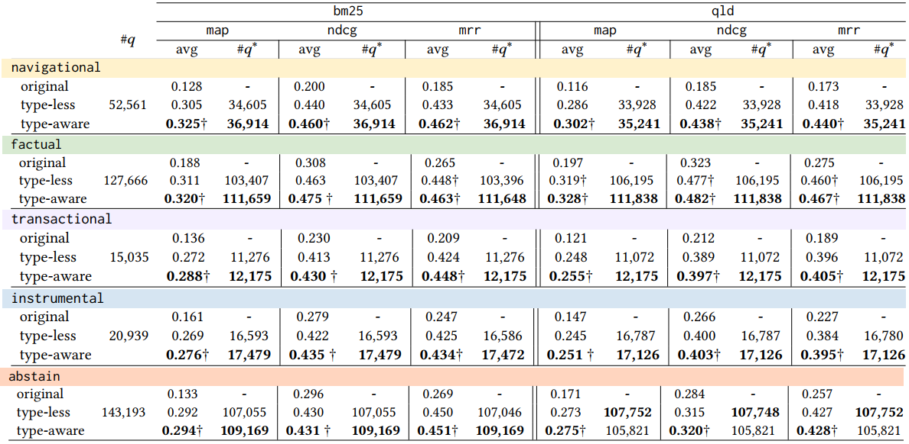

# Understanding the Impact of Query Types on  Query Refinement

Within a search session, users seek their information needs through iterative refinement of their queries, which is daunting. Neuralbased query refinement methods aim to address this challenge via training on gold-standard pairs of (`original query` -> `refined query`), which have been generated through an exhaustive application of unsupervised or supervised modifications to the original query. However, such modifications have been oblivious to the type of queries and, hence, fall short of finding refined versions for many original queries. In this paper, we bridge the gap by incorporating query types when generating refined queries. We fine-tune a conditional transformer, e.g., [`T5`](https://github.com/google-research/text-to-text-transfer-transformer), to map the relevant documents of an original query onto the query’s keywords while conditioning on its type so that, during the inference, the `query type` controls generating new reformulated queries within the same search intent. Among the generated reformulated queries, those that achieve higher retrieval performance than the original query are then selected as refined queries. Our experiments on a large-scale dataset for five query types demonstrated the synergistic effects of considering query types in generating more refined queries with better information retrieval efficacy.


<table align="center" border=0>
<tr>
<td >

- [1. Setup](#1-setup)
  * [Lucene Indexes](#lucene-indexes)
- [2. Quickstart](#2-quickstart)
  * [`pair`](#pair)
  * [`finetune`](#finetune)
  * [`predict`](#predict)
  * [`search`](#search)
  * [`eval`](#eval)
  * [`agg, box`](#agg-box)
- [3. Gold Standard Datasets](#3-gold-standard-datasets)
  * [File Structure](#file-structure)
  * [Settings](#settings)
  * [Stats](#stats)
  * [Samples](#samples)
- [4. Acknowledgement](#4-acknowledgement)
- [5. License](#5-license)

</td>
<td align="center"></td>
</tr>
</table>

## 1. Setup
You need to have ``Python=3.8`` and install [`pyserini`](https://github.com/castorini/pyserini/) package (needs `Java`), among others listed in [``requirements.txt``](requirements.txt). We also suggest you to clone our repo with the `--recurse-submodules` (altenatively, use the `git submodule update --init` inside the cloned repository) to get the [`trec_eval`](https://github.com/usnistgov/trec_eval) metric evaluation tool:

By ``pip``, clone the codebase and install the required packages:
```sh
git clone https://github.com/Fani-Lab/RePair --recurse-submodules
cd RePair
pip install -r requirements.txt
```

By [``conda``](https://www.anaconda.com/products/individual):

```sh
git clone https://github.com/Fani-Lab/RePair --recurse-submodules
cd RePair
conda env create -f environment.yml
conda activate repair
```
_Note: When installing `Java`, remember to set `JAVA_HOME` in Windows's environment variables._

For [`trec_eval`](https://github.com/usnistgov/trec_eval):
```sh
cd src/trec_eval.9.0.4
make 
cd ..
```

### Lucene Indexes
To perform fast IR tasks, we need to build the indexes of document corpora or use the [`prebuilt-indexes`](https://github.com/castorini/pyserini/blob/master/docs/prebuilt-indexes.md) like [`msmarco.documnet`](https://rgw.cs.uwaterloo.ca/pyserini/indexes/faiss-flat.msmarco-doc-per-passage.tct_colbert-v2-hnp.tar.gz). The path to the index need to be set in [`./src/param.py`](./src/param.py) like [`param.settings['msmarco.doc']['index']`](./src/param.py#L24).


## 2. Quickstart
We use [`T5`](https://github.com/google-research/text-to-text-transfer-transformer) to train a model, that when given an input query (origianl query), generates refined (better) versions of the query in terms of retrieving more relevant documents at higher ranking positions. Currently, we finetuned [`T5`](https://github.com/google-research/text-to-text-transfer-transformer) model on [`orcas`](https://dl.acm.org/doi/abs/10.1145/3477495.3531737) (`type-less` and `type-aware` model).

As seen in the above [`workflow`](./misc/workflow.png), it has four pipelined steps: 
> 1. Transformer Finetuning: [`pair`, `finetune`]
> 2. Refined Query Prediction: [`predict`]
> 3. Performance Evaluation: [`search`, `eval`]
> 4. Dataset Curation: [`agg`, `box`]

To run our pipeline, we need to set the required parameters of each step in [`./src/param.py`](./src/param.py) such as pairing strategy ([`pairing`](./src/param.py#L28)) for a query set, the choice of transformer ([`t5model`](./src/param.py#L14)), and etc. Then, the pipeline can be run by its driver at [`./src/main.py`](./src/main.py):

```sh
python -u main.py -data ../data/raw/toy.orcas -domain msmarco.doc
```

### [`['pair']`](./src/param.py#L25)
We create training sets based on different pairings of queries and relevant documents in the [`./data/preprocessed/{domain name}/`](./data/preprocessed/) for each domain like [`./data/preprocessed/toy.orcas/`](./data/preprocessed/toy.orcas/) for `msmarco.doc`.

1. `context.query.docs`: context: query -> _concatenated_ relevant documents
2. `context.docs.query`: context: _concatenated_ relevant documents -> query, like in [docTTTTTTQuery](https://github.com/castorini/docTTTTTquery#learning-a-new-prediction-model-t5-training-with-tensorflow)
3. `context.query.doc`: context: query -> relevant document
4. `context.doc.query`: context: relevant documents -> query

where the context will be `query type` (type-aware) or empty (type-less). For instance, for `orcas`, we have [`docs.query.ctx`](./data/preprocessed/toy.orcas/docs.query.ctx.document.train.tsv) for typw-aware model and [`docs.query`](./data/preprocessed/toy.orcas/docs.query.document.train.tsv) for type-less model. Further, if a query has more than one relevant documents, we can either _concatenate_ all relevant documents into a single document, i.e., `doc`+`s` or _duplicate_ the (query, doc) pairs for each relevant document, i.e., `doc`.

After this step, [`./data/`](./data) directory looks like:

```bash
├── data
│   ├── preprocessed
│   │   └── toy.orcas
│   │       ├── docs.query.documents.test.tsv
│   │       ├── docs.query.documents.train.tsv
│   │       ├── queries.qrels.docs.ctx.documents.test.tsv
│   │       └── queries.qrels.docs.ctx.documents.train.tsv
```

The table below presents the number of |q| and |Jq| keywords and relevant documents for a query, respectively of the orcas dataset.

<table align="center" border="0" width="100%">
  <tr>
    <td width="50%" align="center">
      
    </td>
    <td width="50%" align="center">
      
    </td>
  </tr>
</table>

### [`['finetune']`](./src/param.py#L14)
We have used [`T5`](https://github.com/google-research/text-to-text-transfer-transformer) to generate the refinements to the original queries. We can run [`T5`](https://github.com/google-research/text-to-text-transfer-transformer) on local machine (cpu/gpu), or on google cloud (tpu), which is the [`T5`](https://github.com/google-research/text-to-text-transfer-transformer) pereferance,
> - [`local machine (cpu, gpu)(linux, windows)`](https://github.com/fani-lab/personalized_query_refinement/blob/main/RUNT5.md#localhost-cpu-or-gpu)
> - [`google cloud (tpu)`](https://github.com/fani-lab/personalized_query_refinement/blob/main/RUNT5.md#google-cloud-tpu)

We store the finetuned transformer in `./output/{domain name}/{transformer name}.{pairing strategy}`. For instance, for  [`T5`](https://github.com/google-research/text-to-text-transfer-transformer) whose `base` version has been finetuned on a local machine for `toy.orcas`, we save the model in [`./output/toy.orcas/t5.base.local.docs.query.documents/`](./output/toy.orcas/t5.base.local.docs.query.documents/)

After this step, [`./output/`](./output) looks like:

```bash
├── output
│   ├── t5-data
│   │   ├── pretrained_models
│   │   │   └── base
│   │   └── vocabs
│   │       ├── cc_all.32000
│   │       └── cc_en.32000
│   └── toy.orcas
│       └── t5.base.local.ctx.docs.query.documents
│           ├── checkpoint
│           ├── events.out.tfevents.1675961098.HFANI
│           ├── graph.pbtxt
│           ├── model.ckpt-1000000.data-00000-of-00002
│           ├── model.ckpt-1000000.index
│           ├── model.ckpt-1000000.meta
│           ├── model.ckpt-1000005.data-00000-of-00002
│           ├── model.ckpt-1000005.index
│           ├── model.ckpt-1000005.meta
│           ├── operative_config.gin
```

### [`['predict']`](./src/param.py#L16)

Once a type-aware and type-less have been finetuned, we feed input original queries w/ query type into the type-aware model and w/o into the type-less and whaterver the model generates is considered as a `potential` refined query. To have a collection of potential refined queries for the same original query, we used the [`top-k random sampling`](https://aclanthology.org/P18-1082/) as opposed to `beam search`, suggested by [`Nogueira and Lin`](https://cs.uwaterloo.ca/~jimmylin/publications/Nogueira_Lin_2019_docTTTTTquery-v2.pdf). So, we ran the transformer for [`nchanges`](./src/param.py#L16) times at inference and generate [`nchanges`](./src/param.py#L16) potential refined queries. 

We store the `i`-th potential refined query of original queries at same folder as the finetuned model, i.e., `./output/{domain name}/{transformer name}.{pairing strategy}/pred.{refinement index}-{model checkpoint}` like [`./output/toy.orcas/t5.base.local.docs.query.documents/pred.0-1000005`](./output/toy.orcas/t5.base.local.docs.query.documents/pred.0-1000005)

After this step, prediction files will be added to [`./output`](./output):

```bash
├── output
│   └── toy.orcas
│       └── t5.base.local.docs.query.dosumnet
│           ├── original.-1
│           ├── pred.0-1000005
│           ├── pred.1-1000005
│           ├── pred.2-1000005
│           ├── pred.3-1000005
│           ├── pred.4-1000005
```

### [`['search']`](./src/param.py#L17)
We search the relevant documents for both the original query and each of the `potential` refined queries of type-aware and type-less models. We need to set an information retrieval method, called ranker, that retrieves relevant documents and ranks them based on relevance scores. We integrate [`pyserini`](https://github.com/castorini/pyserini), which provides efficient implementations of sparse rankers, including `bm25` and `qld` (query likelihood with Dirichlet smoothing). 

We store the result of search for the `i`-th potential refined query at same folder in files with names ending with ranker, i.e., `./output/{domain name}/{transformer name}.{pairing strategy}/pred.{refinement index}-{model checkpoint}.{ranker name}` like [`./output/toy.orcas/t5.base.local.ctx.docs.query.documents/pred.0-1000005.bm25`](./output/toy.orcas/t5.base.local.ctx.docs.query.documents/pred.0-1000005.bm25).

After this step, search results will be added to [`./output`](./output):

```bash
├── output
│   └── toy.orcas
│       └── t5.base.local.docs.query.dosuments
│           ├── original.-1.bm25
│           ├── original.-1.qld
│           ├── pred.0-1000005.bm25
│           ├── pred.0-1000005.qld
│           ├── pred.1-1000005.bm25
│           ├── pred.1-1000005.qld
│           ├── pred.2-1000005.bm25
│           ├── pred.2-1000005.qld
│           ├── pred.3-1000005.bm25
│           ├── pred.3-1000005.qld
│           ├── pred.4-1000005.bm25
│           ├── pred.4-1000005.qld
```

### [`['eval']`](./src/param.py#L20)
The search results of each potential refined queries are evaluated based on how they improve the performance with respect to an evaluation metric like `map`, `mrr` and `ndcg`. 

We store the result of evaluation for the `i`-th potential refined query at same folder in files with names ending with evaluation metric, i.e., `./output/{domain name}/{transformer name}.{pairing strategy}/pred.{refinement index}-{model checkpoint}.{ranker name}.{metric name}` like [`./output/toy.orcas/t5.base.local.ctx.docs.query.documents/pred.0-1003900.bm25.map`](./output/toy.msmarco.passage/t5.base.local.ctx.docs.query/pred.0-1003900.bm25.map).


After this step, evaluation results will be added to [`./output`](./output):

```bash
├── output
│   └── toy.orcas
│       └── t5.base.local.ctx.docs.query.documents
│           ├── original.-1.bm25.map
│           ├── original.-1.bm25.success.10
│           ├── original.-1.qld.map
│           ├── original.-1.qld.success.10
```
Here is the sample queries from [`orcas`](https://dl.acm.org/doi/abs/10.1145/3477495.3531737) and the search efficacy of type-aware refinements. As underlined, a query type yield better refinement to a query.


### [`['agg', 'box']`](./src/param.py#L12)
Finaly, we keep those potential refined queries whose performance (metric score) have been better or equal compared to the original query, i.e., `refined_query_metric >= original_query_metric and refined_q_metric > 0`.

We keep two main datasets as the final outcome of our pipeline:

> 1. `./output/{input query set}/{transformer name}.{pairing strategy}/{ranker}.{metric}.agg.gold.tsv`: contains the original queries and their refined queries that garanteed the `better` performance along with the performance metric values

> 2. `./output/{input query set}/{transformer name}.{pairing strategy}/{ranker}.{metric}.agg.all.tsv`: contains the original queries and `all` their predicted refined queries along with the performance metric values

For instance, for `toy` query sets of `orcas`, here are the files:

[`./output/toy.orcas/t5.base.local.ctx.docs.query.documents/bm25.map.agg.gold.tsv`](./output/toy.orcas/t5.base.local.ctx.docs.query.documents/bm25.map.agg.gold.tsv)

[`./output/toy.orcas/t5.small.local.ctx.docs.query.documents/bm25.map.agg.all.tsv`](./output/toy.orcas/t5.base.local.ctx.docs.query.documents/bm25.map.agg.all.tsv)

For boxing, since we keep the performances for all the potential queries, we can change the condition and have a customized selection like having [`diamond`](https://dl.acm.org/doi/abs/10.1145/3459637.3482009) refined queries with maximum possible performance, i.e., `1` by setting the condition: `refined_query_metric >= original_query_metric and refined_q_metric == 1`. The boxing condition can be set at [`./src/param.py`](./src/param.py#L12). 

```
'box': {'gold':     'refined_q_metric >= original_q_metric and refined_q_metric > 0',
        'platinum': 'refined_q_metric > original_q_metric',
        'diamond':  'refined_q_metric > original_q_metric and refined_q_metric == 1'}
```


After this step, [`./output`](./output) will further include:

```bash
├── output
│   └── toy.orcas
│       └── t5.base.local.ctx.docs.query.documents
│           ├── qld.map.agg.all.tsv
│           ├── qld.map.agg.all_.tsv
│           ├── qld.map.agg.gold.tsv
│           ├── qld.map.boxes
│           │   ├── diamond.tsv
│           │   ├── gold.tsv
│           │   ├── platinum.tsv
│           │   └── stamps
│           │       ├── diamond.change.qld.map
│           │       ├── diamond.original.qld.map
│           │       ├── gold.change.qld.map
│           │       ├── gold.original.qld.map
│           │       ├── platinum.change.qld.map
│           │       └── platinum.original.qld.map
│           ├── qld.success.10.agg.all.tsv
│           ├── qld.success.10.agg.all_.tsv
│           ├── qld.success.10.agg.gold.tsv
│           └── qld.success.10.boxes
│               ├── diamond.tsv
│               ├── gold.tsv
│               ├── platinum.tsv
│               └── stamps
│                   ├── diamond.change.qld.success.10
│                   ├── diamond.original.qld.success.10
│                   ├── gold.change.qld.success.10
│                   ├── gold.original.qld.success.10
│                   ├── platinum.change.qld.success.10
│                   └── platinum.original.qld.success.10
```


### File Structure
Here is the refined queries for the two original queries in [`./output/toy-orcas/t5.base.local.ctx.docs.query.documents/bm25.map.agg.gold.tsv`](./output/toy.orcas/t5.base.local.ctx.docs.query.documents/bm25.map.agg.gold.tsv) for `aol-ia.title`:

```
qid	    order	  query	                                 bm25.map
2009263	 -1	    Navigational: bbc good food recipies	  0.0393
2009263	pred.8	 bbc good food	                         0.5533
2009263	pred.6	 bbc good food http://www.bbcgoodfood.com/recipes	 0.5667
2009263	pred.10	bbc good food package                   0.0974
2009263	pred.3	 bbc new food	                           0.0725
2009263	pred.4	 www.bbcgoodfood.com/recipes	            0.0075
```
As seen, `order: -1` shows the original query with its retrieval preformance. For the rest, it shows the refined queries in decreasing retrieval performance. For instance, for the original query `query: bbc good food recipies`, the retrieval performance is `bm25.map: 0.0393` while the best refined query could imporove it to `bm25.map: 0.5667`! 

### Settings

Our pipeline refine the queris by considering the types of them for `orcas` query sets using `t5.base` transformer on google cloud's tpus (`gc`) with `docs.query` pairing strategy for `bm25` ranker and `map` evaluation metric. The golden datasets along with all the artifacts including preprocessed `docs.query` pairs, model checkpoint, predicted refined queries, their search results and evaluation metric values are available at the above links. The running settings were:

```
settings = {
    't5model': 'base.gc'
    'iter': 4000,       # number of finetuning iteration for t5
    'nchanges': 10,     # number of changes to a query
    'ranker': 'bm25',   
    'batch': 100,       # search per batch of queries using pyserini, if None, search per query
    'topk': 100,        # number of retrieved documents for a query
    'large_ds': True,   # set if dataset size is greater than one Million
    'metric': 'map',    # any valid trec_eval.9.0.4 metric like map, ndcg, recip_rank, ...
    'box': {'gold':     'refined_q_metric >= original_q_metric and refined_q_metric > 0',
            'platinum': 'refined_q_metric > original_q_metric',
            'diamond':  'refined_q_metric > original_q_metric and refined_q_metric == 1'},
    'msmarco.doc': {
        'index_item': ['document'],    
        'index': '../data/raw/orcas/lucene-index.msmarco-v1-doc.20220131.9ea315', #' ../data/raw/robust/lucene-index.robust04.pos+docvectors+rawdocs',  # change based on index_item
        'pairing': [ 'ctx', 'docs','query'],     # [context={2 scenarios, one with userID and one without userID). input={'userid','query','doc(s)'} output={'query','doc(s)'}
        'lseq': {"inputs": 2048, "targets": 32},  # query length and doc length for t5 model,
        'filter': {'minql': 1, 'mindocl': 10}   # [min query length, min doc length], after merge queries with relevant 'index_item', if |query| <= minql drop the row, if |'index_item'| < mindocl, drop row
    }
}
```


### Results



**Future Work**: our future research direction includes other conditional transformers than t5 as well as dense retrievers, to explore whether our findings generalize to such new settings.


## 4. Acknowledgement
We benefit from [``trec_eval``](https://github.com/usnistgov/trec_eval), [``pyserini``](https://github.com/castorini/pyserini), [``ir-dataset``](https://ir-datasets.com/), and other libraries. We would like to thank the authors of these libraries and helpful resources.
  
## 5. License
©2023. This work is licensed under a [CC BY-NC-SA 4.0](license.txt) license.

Zahra Taheri<sup>1</sup>, [Hossein Fani](https://hosseinfani.github.io/)<sup>1,2</sup> 

<sup><sup>1</sup>School of Computer Science, Faculty of Science, University of Windsor, ON, Canada.</sup>
<sup><sup>2</sup>[hfani@uwindsor.ca](mailto:hfani@uwindsor.ca)</sup>

