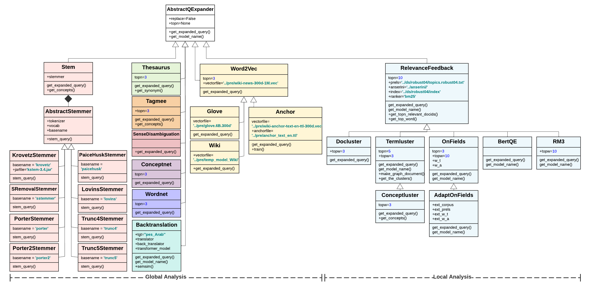

# Refiners

The objective of query refinement is to produce a set of potential candidate queries that can function as enhanced and improved versions. This involves systematically applying various unsupervised query refinement techniques to each query within the input dataset.

<table align="center" border=0>
<thead>
  <tr><td colspan="3" style="background-color: white;"></td></tr>     
  <tr><td colspan="3">
      
Class Diagram for Query Refiners in <a href="./src/refinement/">src/refinement/</a>. [<a href="https://app.lucidchart.com/documents/view/64fedbb0-b385-4696-9adc-b89bc06e84ba/HWEp-vi-RSFO">zoom in!</a>].

      
 The expanders are initialized by the Expander Factory in <a href="./src/refinement/refiner_factory.py">src/refinement/refiner_factory.py</a>
</td></tr> 
 </thead>
</table>

This README provides comprehensive information about the refiners used in the RePair project, categorized into _global_ and _local_ unsupervised refinement methods. 
These methods are crucial for generating gold-standard datasets for training supervised or semi-supervised query refinement techniques. 
[Global](#Global) methods operate solely on the original query, refining it without external context. 
In contrast, [Local](#Local) refiners take into account terms from the top-k retrieved documents obtained through an initial information retrieval process, such as _bm25_ or _qld_. 
The local approaches allow for the addition of similar or related terms to the original query, thereby enhancing the relevance and accuracy of the refined queries.

# Global

## Backtranslation
Back translation, also known as reverse translation or dual translation, involves translating content, whether it is a query or paragraph, from one language to another and retranslating it to the original language. This method provides several options for the owner to make a decision that makes the most sense based on the task at hand.
For additional details, please refer to this [document](./misc/Backtranslation.pdf).

## Example
| **q** 	| **map q** 	| **language** 	| **translated q** 	| **backtranslated q** 	| **map q'** 	|
|---	|:---:	|:---:	|:---:	|:---:	|:---:	|
| Italian nobel prize winners 	| 0.2282 	| farsi 	| برندهای جایزه نوبل ایتالیایی 	| Italian Nobel laureates 	| 0.5665 	|
| banana paper making 	| 0.1111 	| korean 	| 바나나 종이 제조 	| Manufacture of banana paper 	| 1 	|
| figs 	| 0.0419 	| tamil 	|  அத்திமரங்கள்  	| The fig trees 	| 0.0709 	|

## tagme
This method replaces the original query's terms with the title of their Wikipedia articles.

## stemmers
which utilize various lexical, syntactic, and semantic aspects of query terms and their relationships to reduce the terms to their roots, including krovetz, lovins, paiceHusk, porter, sremoval, trunc4, and trunc5,

## semantic refiners
which use an external linguistic knowledge-base including thesaurus, wordnet, and conceptnet, to extract related terms to the original query's terms,

## sense-disambiguation
which resolves the ambiguity of polysemous terms in the original query based on the surrounding terms and then adds the synonyms of the query terms as the related terms, 

## embedding-based methods
which use pre-trained term embeddings from glove and word2vec to find the most similar terms to the query terms,

## anchor
which is similar to embedding methods where the embeddings trained on wikipedia articles' anchors, presuming an anchor is a concise summary of the content in the linked page,

## wiki
which uses the embeddings trained on wikipedia's hierarchical categories to add the most similar concepts to each query term.

# Local

## relevance-feedback
wherein important terms from the top-k retrieved documents are added to the original query based on metrics like tf-idf,
clustering techniques including termluster, docluster, and conceptluster, where a graph clustering method like Louvain are employed on a graph whose nodes are the terms and edges are the terms' pairwise co-occurrence counts so that each cluster would comprise frequently co-occurring terms. 
Subsequently, to refine the original query, the related terms are chosen from the clusters to which the initial query terms belong. 
    
## bertqe
which employs bert's contextualized word embeddings of terms in the top-k retrieved documents.
